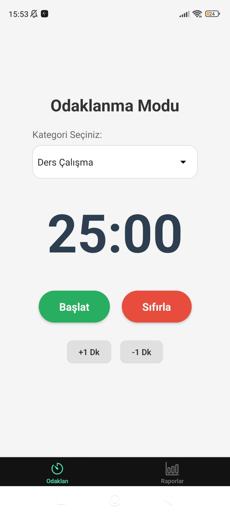

🎯 Odaklanma Takibi ve Raporlama Uygulaması (Mobil Uygulama Geliştirme Dersi Proje Ödevidir)

Bu proje, dijital dikkat dağınıklığı ile mücadele etmek ve kişisel verimliliği artırmak amacıyla geliştirilmiş React Native tabanlı bir mobil uygulamadır.

Kullanıcıların odaklanma seanslarını takip eder, uygulama dışına çıkışları (dikkat dağınıklığını) tespit eder ve yerel veritabanı kullanarak detaylı grafiksel raporlar sunar.

📱 Ekran Görüntüleri




✨ Özellikler

⏱️ Gelişmiş Zamanlayıcı: Kullanıcı tanımlı odaklanma süreleri (Pomodoro mantığı).
⚠️ İhlal Tespiti (Distraction Tracking): `AppState` API kullanılarak, seans sırasında uygulamanın arka plana atılması (başka uygulamaya geçilmesi) "dikkat dağınıklığı" olarak kaydedilir.
📂 Kategorizasyon: Ders, Kodlama, Kitap Okuma gibi farklı kategorilerde takip.

📊 Detaylı Raporlama:
    Bar Chart: Son 7 günün odaklanma süreleri.
    Pie Chart: Kategorilere göre zaman dağılımı.
    Özet Kartlar: Günlük ve toplam verimlilik istatistikleri.
💾 Offline-First Mimari: Tüm veriler `SQLite` ile kullanıcının cihazında yerel olarak saklanır. İnternet gerektirmez.

 🛠️ Kullanılan Teknolojiler

Framework: React Native (https://reactnative.dev/) (Expo SDK 52)
Dil: TypeScript
Veritabanı: `expo-sqlite` (Yerel İlişkisel Veritabanı)
Navigasyon: Expo Router (Dosya tabanlı yönlendirme)
Grafikler: `react-native-chart-kit`
İkonlar: Expo Vector Icons

🧠 Veritabanı Tasarımı
Uygulama tek bir sessions tablosu üzerinden çalışır:
Sütun	Tip	Açıklama
id	INTEGER	Benzersiz ID
category	TEXT	Odaklanma Kategorisi
duration	INTEGER	Odaklanılan Süre (Saniye)
distractionCount	INTEGER	Bölünme Sayısı
date	TEXT	Tarih (YYYY-MM-DD)


 🚀 Kurulum ve Çalıştırma

Projeyi kendi bilgisayarınızda çalıştırmak için aşağıdaki adımları izleyin.

Gereksinimler
Node.js (LTS sürümü önerilir)
Git
Telefonunuzda Expo Go uygulaması (App Store / Play Store'dan indirin)

Adım 1: Projeyi Klonlayın
```bash
git clone [https://github.com/KULLANICI_ADIN/OdakTakip.git](https://github.com/KULLANICI_ADIN/OdakTakip.git)
cd OdakTakip

Adım 2: Bağımlılıkları Yükleyin
Bash
npm install

Adım 3: Uygulamayı Başlatın
Bash
npx expo start

Adım 4: Telefonunuzda Çalıştırın
Terminalde çıkan QR Kodu, telefonunuzdaki Expo Go uygulaması ile okutun.
•	Android: Expo Go uygulamasından "Scan QR Code" diyerek.
•	iOS: Standart kamera uygulamasını açıp QR kodu okutarak.


